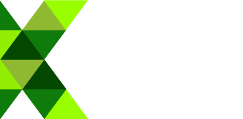

Grin is being tested. The release is planned for early 2019.
{: .notice--warning}

### Grin builds electronic transactions for all, without censorship or restrictions.

Grin empowers anyone to transact or save modern money without the fear of external control or oppression. Grin is designed for the decades to come, not just tomorrow. Grin wants be usable by everyone, regardless of borders, culture, skills or access.

	<article class="entry h-entry">
		<header class="entry-header">
			<h3 class="entry-title p-name">
			  <i class="fas fa-feather-alt"></i>
				Private
			</h3>
		</header>
		

			Grin has no amounts and no addresses. Transactions are additionally obscured. To hide where a newly created transaction comes from, it gets relayed privately (a "random walk") among peers before it is publicly announced.
		

	</article>
	<article class="entry h-entry">
		<header class="entry-header">
			<h3 class="entry-title p-name">
			  <i class="fas fa-bolt"></i>
				Scalable
			</h3>
		</header>
		

			MimbleWimble leverages cryptography to allow most of the blockchain data to be removed. In particular, nearly all past transaction data is pruned.
		

	</article>
	<article class="entry h-entry">
		<header class="entry-header">
			<h3 class="entry-title p-name">
			  <i class="fas fa-arrows-alt"></i>
				Decentralized
			</h3>
		</header>
		

			Grin is developed openly, by open source developers based in different countries. It's not controlled by any company, foundation or individual. The coin distribution is designed to be as fair (but not gratis) as is known to be possible.
		

	</article>

## Funding

Grin is launched fairly, **free of ICO, pre-mine or founder's reward**. We rely on donations to keep working on the project. If you have the means, [we humbly ask you to please donate](funding.html).

### Funding contributors

## Private funding contributors
Aurel - Chris McCann - Jack Misteli Jean-Guillaume - Jameson Lopp - Max Tannahill - Michalis Kargakis - Redouan Ahaloui - Roy Blankman - Niels de Ruiter

## Anonymous funding contributors
And all our great anonymous supporters! We're not forgetting your contribution, and are working to protect that choice!

## And you?
If you have the means, [we humbly ask you to please donate](funding.html).
